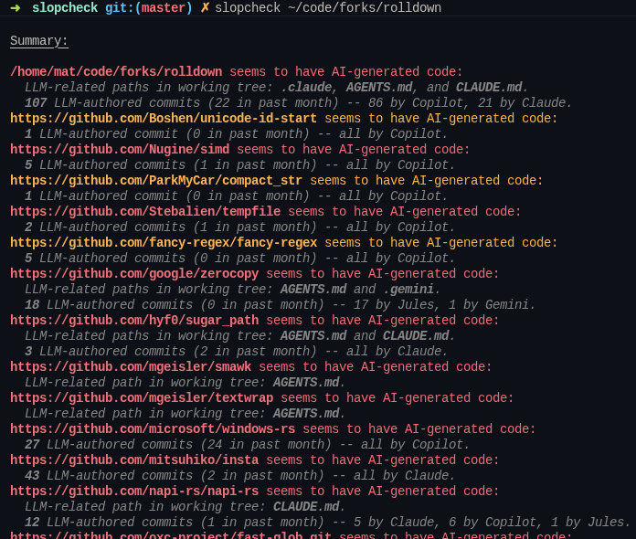

# Slopcheck

A CLI tool that checks for indicators of AI-generated code in a project and its dependencies.



Currently, checking dependencies is only implemented for Rust (Cargo) projects.

Partial cloned repositories are cached in `~/.cache/slopcheck/clones` or [your operating systems's cache directory](https://docs.rs/dirs/latest/dirs/fn.cache_dir.html). If a repository hasn't been touched in 24 hours, `git pull` is run.

It is not advised to run Slopcheck on untrusted projects, as it may request arbitrary sources and possibly run build scripts.

## Features

- Shows whether a repository has commits by a known LLM (Claude, Copilot, etc).
- Looks for the presence of files like `CLAUDE.md`, `AGENTS.md`, etc in the working tree or in the `.gitignore` (for projects trying to hide them).
- Checks all dependencies and displays if they have indicators of AI too.
- Distinguishes between current and former LLM use.

## Usage

```sh
cargo install --git https://github.com/mat-1/slopcheck
slopcheck ./something
```
